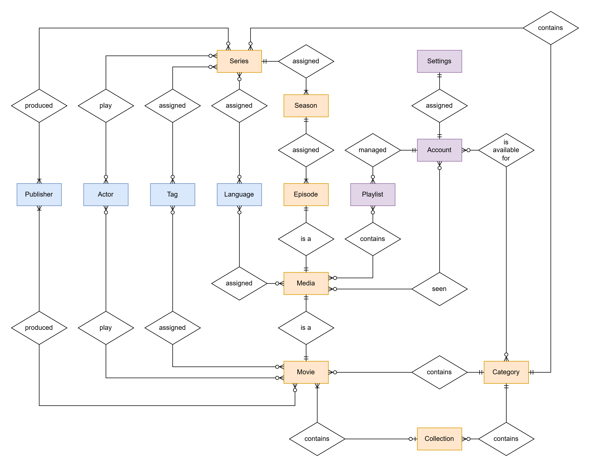

# Awave_Metadata-Server

Der Awave-MetadataServer stellt den Datenbankbestandteil des Awave-Streamingsystems dar.

## Funktionsbereich

Dieser übernimmt konkret folgende Aufgaben:

- Content-Katalog
	
	Der Server liefert alles was der Nutzer sieht, bevor er auf "Play" drückt.
	
	- Strukturierung: Stellt dem Client konkrete Informationen zu unterschiedlichen Medien zur Verfügung
	- Discovery: Liefert Daten für die Suche, Filterung nach Genres, Tags oder anderen Indikatoren
	- Assets-Verwaltung: Speichert zwar keine Images selbst, liefert aber die URLs zu Postern und Thumbnails
	
- Personalisierung & User-State
	
	Der Server dokumentiert Personalisierungen und Nutzerverhalten mit
	
	- Fortschrittsbalken: Speichert für jeden Account sekundengenau, wo ein Video pausiert wurde.
	- Playlists: Verwaltet Playlists, die automatisch durch gewählte Tags entstehen und Favoriten der Nutzer
	- Profile & Settings: Server weiß, z.B. welche Sprache der Nutzer bevorzugt (Audio/Subtitle)

- Streaming-Logistik
	
	Der Server vermittelt zwischen dem Client und dem eigentlichen Video-File auf dem Streaming-Server
	
	- Pfad-Auflösung: Beim Streamstart eines Clients wird der Server dazu aufgerufen auf dem Streaming-Server die entsprechende URL weiterzugeben
	- Berechtigung: Überprüft, ob der Nutzer überhaupt angemeldet ist und diesen Inhalt sehen darf, bevor die URL weitergegeben wird
	
	
- Automatisierung
	
	Dies betrifft vor allem die Kommunikation zur Admin-Schnittstelle
	
	- Halbauto-Matching: Durch die Admin-Schnittstelle wird bei Festellung neuer Medien auf dem Streaming-Server neue Meta-Data durch diesen auf die DB gespeichert
	- Backend-Logik: Auf Befehl der Admin-Schnittstelle werden einträge nach CRUD bearbeitet und verwaltet
	
## ERM-Struktur der Datenbank

Alle Entitäten mit ihren jeweiligen Attributen unterteilen sich in drei Kategorien:

- Account-Relevant (Lila)
	
	Entitäten, die pro Account personalisiert diesem zugeordnet und von dem jeweiligen Nutzer verwaltet werden
	
	- Account: Identifikation eines Nutzers
		- account_id
		- created_at
		- email
		- username
		- hashed_pw
		- profilpicture_url
		- date_od_birth
		
	- Settings: Account-speziefische Endgerät-übergreifende Einstellungen
		- settings_id
		- prefered_language
		- audio_language
		- subtitle_language
		- seen_media_progress_value	(Beschreibt in % ab wann ein Video als "Gesehen" markiert wird)
		- prefered_resolution
		- select_autoplay
		
	- Playlist: Vom Nutzer selbst erstellte Playlist, die manuell hinzugefügte Media oder durch verschiedene Tags autogeneriert ist
		- playlist_id
		- title
	
- Grundstruktur der Medien (Gelb)

	Entitäten, die zueinander die Relation darstellen, in der Medien auf dem Streamingsystem abgebildet sind
	
	- Media: Ursprungs-Entität für sämtliche Äußerungen von Mediendateien
		- media_id
		- title
		- title_alternative
		- description
		- release_date
		- upload_date
		- duration_in_sec
		- age_rating
		- thumbnail_url
		- media_url
		- timestamp_intro_start
		- timestamp_intro_end
		- timestamp_outro_start
		- timestamp_outro_end
		
	